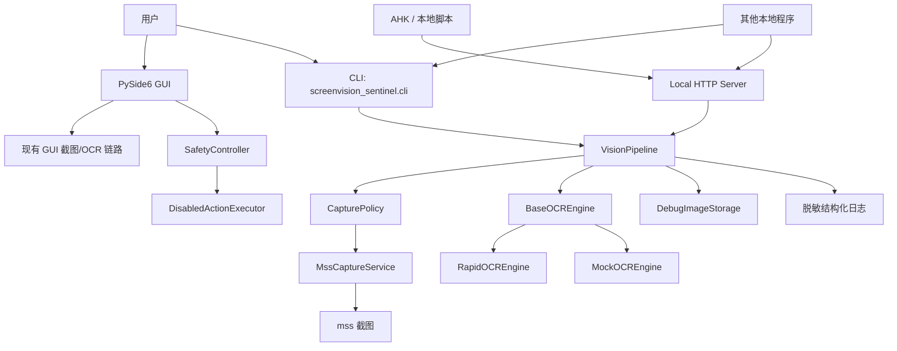

# 技术架构

最后更新日期：2026-07-05

## 当前架构图

说明：

- CLI 和 Server 已迁移到 `VisionPipeline`。
- GUI 仍使用既有 `MssCaptureService` 与 OCR Engine，尚未迁移到 `VisionPipeline`。
- `SafetyController` 属于动作安全层，不承担视觉区域校验职责。

## 模块职责

- `vision/`：统一视觉主干，包含 Pipeline、区域策略、结果模型和安全调试截图保存。
- `app/`：配置加载和安全默认值。
- `ui/`：PySide6 界面和用户交互。
- `cli.py`：命令行入口，供本地脚本和 AHK 间接调用。
- `server.py`：本地 HTTP Server，供 AHK 或其他本地程序低延迟调用。
- `capture/`：屏幕区域截图抽象和 mss 实现。
- `ocr/`：OCR 引擎统一接口、RapidOCR、Mock OCR 和工厂回退。
- `detection/`：当前识别结果与历史结果比较。
- `safety/`：动作安全开关、紧急停止和动作准入控制。
- `actions/`：未来鼠标或键盘动作接口，当前默认阻止。
- `storage/`：SQLite 初始化和后续事件持久化。
- `utils/`：通用工具，如日志配置。

## VisionPipeline

`VisionPipeline.capture_and_ocr()` 当前职责：

1. 接收 `ScreenRegion`。
2. 调用 `CapturePolicy` 校验区域。
3. 调用 `MssCaptureService` 进行单次内存截图。
4. 可选调用 `DebugImageStorage` 保存调试截图。
5. 调用 OCR Engine 识别。
6. 统一返回 `VisionResult`。
7. 记录不含 OCR 全文和调试路径的结构化日志。

`VisionResult` 包含：

- `success`
- `text`
- `confidence`
- `boxes`
- `elapsed_ms`
- `capture_elapsed_ms`
- `ocr_elapsed_ms`
- `engine_name`
- `region`
- `request_id`
- `debug_image_path`（仅请求保存且成功时返回）
- `error_code`
- `error_message`

## CapturePolicy

当前默认限制：

| 参数 | 默认值 |
| --- | --- |
| 最大宽度 | 7680 |
| 最大高度 | 4320 |
| 最大像素数 | 16,777,216 |
| 最小坐标 | -100000 |
| 最大坐标 | 100000 |

校验内容：

- 必须恰好四个值。
- 必须是严格整数，拒绝 bool、float、NaN、非数字字符串。
- `width > 0`。
- `height > 0`。
- 宽、高、总像素数不能超过限制。
- 左上角和右下角坐标必须位于合理范围内。

## DebugImageStorage

调试截图策略：

- 固定目录：`data/debug/`。
- 调用方只能传布尔开关，不能传路径。
- 文件名由程序生成：时间戳 + 随机短 ID + `.png`。
- 不覆盖已有文件。
- 保存失败只记录错误类型，不影响 OCR 主结果。
- 普通日志不记录调试截图路径。

## Server

当前 Server 实现：

- 文件：`src/screenvision_sentinel/server.py`
- 类型：标准库 `HTTPServer`
- 并发模型：串行处理请求
- 默认地址：`127.0.0.1:8181`
- 端口策略：`LocalHTTPServer` 使用 Windows 独占地址绑定，不允许多个旧/新服务共享 `127.0.0.1:8181`；重复启动会提示先关闭旧服务。
- 健康检查：`GET /health`
- OCR 接口：`POST /ocr`
- 批量 OCR 接口：`POST /ocr/batch`
- 单次监测接口：`POST /monitor/tick`，使用批量 OCR 请求体并记录一次确认状态
- 后台监测启动接口：`POST /monitor/start`，仅显式请求后创建一个 daemon 线程；请求可传 `interval_seconds`（`0.5`–`60` 秒），周期调试截图强制关闭
- 后台监测停止接口：`POST /monitor/stop`，使用 `{}` 请求体，当前 OCR 轮完成后停止
- 监测状态接口：`GET /monitor/status`，只返回字段名、结构类型、连续确认计数、稳定/变化状态和时间戳，不返回 OCR 原文或值指纹
- 版本识别：`GET /health` 返回 `api_revision` 和 `background_monitor_available`，AHK 用于在调用后台接口前识别过期服务。
- 批量性能：真实 `VisionPipeline` 下 `/ocr/batch` 复用一次共享截图，返回 `shared_capture`、`capture_elapsed_ms`、`ocr_elapsed_ms`、`elapsed_ms`、`texts`、`summary` 及不含识别原文的 `ocr_mode`、`fallback_count`、`empty_count`、`review_count` 和批量耗时诊断字段
- 批量回退：共享截图结果全空时，自动回退逐项稳定读取，并返回 `shared_capture_fallback`
- 字段校验：请求可选 `field_type=text|number|date|datetime|gender`；响应追加 `validation_status`、`is_valid`、`requires_review`。它只做可读性、置信度和字符结构检查，绝不改写 OCR 原文或做临床规则判断。

启动脚本：

- `start_server.bat` 会先设置 `PYTHONPATH=%CD%\src;%PYTHONPATH%`
- 目的：优先加载当前工作区源码，避免 `.venv\Lib\site-packages` 中旧安装包覆盖最新 Server 代码
- 空读兜底：OCR 成功但文本为空时，最多再尝试一次相反识别模式；每个字段总计最多两轮，并在结果中返回 `fallback_used` 与 `fallback_strategy`

串行策略原因：

- 当前没有 RapidOCR 线程安全证据。
- 串行处理避免同一 OCR 实例被多个请求同时调用。
- 本轮不引入 `ThreadPoolExecutor`，不制造无证据并发。

限制：

- `HTTPServer` 单请求阻塞时会阻塞后续请求。
- 当前没有真正强制取消 OCR 的机制。
- 客户端应设置连接和读取超时。
- 后续如需并发，应先验证 RapidOCR 线程安全，或考虑进程隔离。
- 兜底重试会增加单项耗时；稳定和极速模式都会在空读时启用受限兜底，不改变调用方的请求格式。
- `/monitor/tick` 仍可由调用方手动触发。连续后台监测仅在 `/monitor/start` 成功后运行，服务启动本身不会自行定时截图；`/monitor/stop` 不伪造强制取消，而是等待当前 OCR 轮完成。事件持久化、告警和长时间运行验收仍是后续阶段。
- 后台线程与 HTTP OCR 请求共用同一执行锁，确保同一个 RapidOCR 实例不会被并发调用；状态查询不返回 OCR 原文、值指纹、坐标或截图。

## CLI

当前 CLI 实现：

- `--rect left,top,width,height`
- `--rects "a,b,c,d;e,f,g,h"`
- `--engine rapidocr|mock`
- `--save-debug` 纯开关

CLI 输出 JSON。非法参数返回非零退出码，并尽量保持 stdout 为可解析 JSON。

## AHK

当前 AHK 主入口：

- 文件：`scripts/ahk_example.ahk`
- 单次调用：本地 Server `http://127.0.0.1:8181/ocr`
- 批量调用：本地 Server `http://127.0.0.1:8181/ocr/batch`
- 单次监测调用：本地 Server `http://127.0.0.1:8181/monitor/tick`
- 后台监测启动/停止：本地 Server `http://127.0.0.1:8181/monitor/start`、`http://127.0.0.1:8181/monitor/stop`
- 监测状态读取：本地 Server `http://127.0.0.1:8181/monitor/status`
- 调试截图：默认关闭；开启后只发送 `"save_debug": true`
- 路径策略：不向 Server 传递自定义调试截图路径

`scripts/ahk_example.ahk` 当前是自包含只读 OCR 工作台，使用鼠标按钮完成帮助、服务检查、目标窗口选择、自动选窗坐标拾取、单项读取、高速批量汇总、复制 JSON 和启动服务。不注册 F1-F12 全局热键，不执行点击、提交或临床动作。

AHK 已配置的患者字段包括：姓名、性别、出生日期、年龄、患者编号、患者科室、床号、检查科室、检查时间、编辑时间和申请单号。

AHK 工作台的批量显示汇总采用 `/ocr/batch` 一次请求读取。当前默认使用稳定模式 `fast_mode=false`，用户可显式勾选极速模式；Server 对空读执行受限兜底。工作台为数字、日期/时间和性别字段附加结构类型，并将空读、低置信度、格式不符显示为“建议人工复核”。工作台新增“启动后台监测”“停止监测”“监测状态”按钮：它们只调用本地 Python API，不执行任何鼠标键盘自动化。

坐标写回后，AHK 会同步更新当前进程中的坐标变量，不再自动 `Reload`。目标窗口选择会通过 Win32 `GetAncestor` 归一到顶层窗口，避免 Gink 子窗口句柄变化造成相对坐标漂移。界面同时显示坐标配置名称：离线工作包固定标注为“工作电脑（2026-07-08 人工测量）”，本机脚本标注为本机调试坐标。

## OCR 引擎

统一接口为 `BaseOCREngine`，返回 `OCRResult`。

当前实现：

- `RapidOCREngine`：使用 `rapidocr_onnxruntime`。
- `MockOCREngine`：测试和回退用。
- `create_ocr_engine()`：未知引擎或 RapidOCR 初始化失败时回退 Mock OCR。

RapidOCR 对内存截图空读时会尝试多个小字段图像版本：原始截图、去 alpha 后的 BGR 图、放大图和二值化图。该策略主要面向 Gink 参数区这种 20-40 像素高的短文本/数字区域。

Protocol 支持结构化类型。当前未发现因实现类未显式继承 Protocol 导致的方法签名问题。

## 配置设计

`AppConfig` 当前集中管理：

- OCR 引擎名称。
- 最大截图宽度、高度和总像素数。
- 坐标范围。
- 调试截图目录。
- Server 地址和端口。
- 自动动作默认开关。
- 监控区域。

`config/local.toml` 可覆盖本地配置，默认被 `.gitignore` 保护。

## 日志设计

当前原则：

- Pipeline 日志只记录请求 ID、成功状态、引擎、耗时、字符数和错误类别。
- Server 不记录请求体、OCR 全文或调试截图路径。
- GUI 会在本地界面显示 OCR 文本，但不默认落盘。

## 截图与 DPI

GUI 区域选择当前通过 `CaptureScreenGeometry` 将 Qt 逻辑坐标映射到 mss 物理像素坐标。

已自动化测试：

- 125% 缩放场景。
- 偏移副屏场景。

尚未人工验证：

- 真实 Windows 桌面。
- 多显示器。
- 远程桌面。
- 混合 DPI。

## 动作执行隔离原则

- 识别模块不直接调用鼠标或键盘动作。
- 检测模块只输出结果，不执行动作。
- 动作执行必须经过 `SafetyController`。
- 默认 `automatic_actions_enabled=False`。
- 紧急停止后必须阻止动作。
- 当前阶段的 `DisabledActionExecutor` 会拒绝所有动作。
